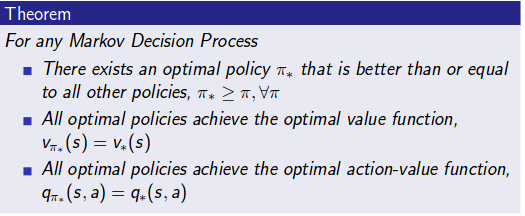
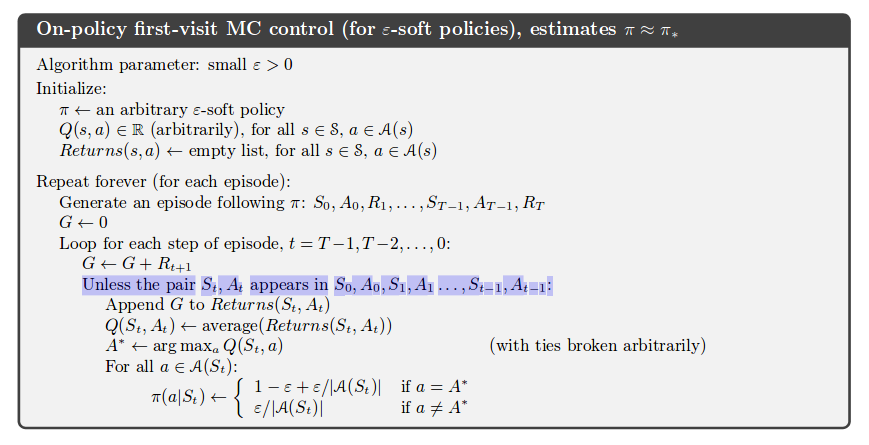

# PFE

*Objectif* :
 Implementation d'algorithmes de machine learning dans le domaine des bots, dans le but d'éviter la détection.

 *Hypothése* : 

 Utilisation du reinforcement learning afin d'entrainer notre bot a passer outre les défenses des sites internet.

 ## Documentation

 ## 19/09/2018

 ### Internet bots

 Les bots internet sont des scripts écrits dans le but de réaliser des actions prédéfinies sur des pages internet sans l'intéraction humaine. Des example d'applications de bots possible sont :
 * le web scraping, qui consiste au parcours de pages internet afin d'en récupérer des données ciblées
 * Les chatbots, qui permettent de mettre en place une communication avec les utilisateurs, avec une interaction préalablement définie. Par exemple, des chatbots existent sous facebook et twitter, et permettent de faire la publicité de produits.
 * Les bots sociaux regroupent les chatbots mais implémentent également d'autres aspects, tels que la mimique des comportement humains afin de se faire passer pour un utilisateur lambda sur un réseau social.
 
 D'un autre coté, la présence des bots invoque également des risques liés a la privacité, ou à la sécurité de l'environnement de l'utilisateur. Des example de ce type de bots sont représentés par les spambots qui se chargent de récupérer des listes d'emails dans le but de procéder au spamming. 
 Les attaques DDoS sont également réalisés par des bots qui se chargent de réaliser une multitude d'attaque afin de saturer le serveur hébérgeant le site internet.
 Le website scrapping peut également être vu comme malveillant dans certains cas car certains dévelopeurs peuvent concevoir leur bot dans le but de récupérer la totallité de la page afin de réutiliser le contenu sans permissions.

 Enfin, pour résumer le tout, les bots sont simplement des scripts destinés à se charger d'actions prédéfinis par le dévelopeurs, que sa vision soit malveillante, ou pas.

 ### Guide d'implémentation d'un bot

 L'implémentation de bots internet varie fortemment selon le domaine d'action de notre bot. Cependant, la logique de fond reste la même et le language de programmation utilisé importe peu, dans la mesure où il est possible de réaliser des requêtes Http(s). 
 Selon le type de bot désiré, il est nécessaire de connaitre la structure des cibles auxquels il est destiné :  une analyse rapide de ceux-ci permet génerallement d'extraire une structure général que le code frontend du bot permettra d'exploiter.
 Un serveur backend est également à implémenter dans le but de mettre en place le business logic du bot.

 *Update* : Cette approche est old-school. Nous tendons actuellement à privilégier les technologies modernes basés sur Headless, simplifiant la tâche.

 ### Chrome headless

 Un environnement headless représente un environnement sans GUI. Chrome headless est ainsi une "variante" du navigateur chrome, sans interface utilisateur, et ainsi, plus axée pour le testing automatisé, le dévelopement de bots destinés au web crawling, ou toute sorte d'application ou la présence d'un GUI n'est pas requise.
 *Puppeteer* est la librairie Node officielle utilisant Chrome Headless afin d'exploiter le contenu de pages web. 

 ### Méthodes de détection de bots selon l'état de l'art

En extrayant les informations récupérés pour chaque sessions, plusieurs régles peuvent être determinés et ménent à une détection plus ou moins probable du bot :

* [BLOG OR BOT](http://cs229.stanford.edu/proj2017/final-reports/5240610.pdf) Bots detections based on mouse interactions and keystrokes. The solution provided reaches a 97.2% TPR and a 0.2% FPR.

* La durée de la session : une session est définie du moment qu'un agent accéde au site internet (détecté par son IP, ou son empreinte) jusqu'à l'inactivité (?) de celui-ci.

* Le nombre de requêtes réalisés : un utilisateur normal tend à réaliser un nombre de requête significativement inférieur au nombre de requêtes réalisés par un bot.

* Le pourcentage de requêtes HTML : à definir

* Le nombre de requêtes sans la préseance du header http referer : le header http referer contient l'adresse de la page précédente visité, menant à la page actuelle (par la présence d'un lien). Cet en-tête n'est pas défini dans le cas ou la resource précédente est représentée par une URI de type data ou si un différent de protocoles de sécurité existe entre les pages(de HTTPS à HTTP). Un pourcentage important de bots tendent à ne pas définir cet en-tête, ou a ne pas le définir correctement. A noter que les humains peuvent également désactiver cet en-tête.

* Pourcentage d'images récupérés : les bots tendent à ignorer les images.

* Pourcentage de requêtes PDF : Les bots tendent à les demander en totalité tandis que les humains tendent à selectionner leur utilisation.

* Utilisation du header HEAD : Le header HEAD est *parfois* (?) utilisé par les bots afin d'obtenir moins de données du site web. Le header HEAD permet de demander au site les headers qu'il aurait renvoyé dans le cas d'une requête GET classique. Un humain tend à ne presque jamais passer par la requête HEAD.

* Pourcentage d'erreurs 4xx : Les bots tendent à disposer de ce pourcentage plus élevé, en raison du fait qu' un bot tend à tenter d'accéder à des ressources sans en connaitre le contenu.

* Demande du robots.txt : un humain ne demande pas le robots.txt

* Pourcentage de requêtes HTTP sequentielles : les humains tendent à disposer d'un pourcentage plus élevés en raison d'une demande moindre pour des ressources de type script, images, doc...

* Standard deviation of requested page's depth. <--- Pas compris, a developper

* Adresse IP : Une utilisation intensive d'une adresse IP disposant des précédents attributs est douteuse. 

## 20/09/2018

### Reinforcement learning

Model free algorithms are the go in reinforcement learning as they remove the need for space to store all combination of states and actions.

#### Terms definiton :

*MDP* :  Markov Decision Process. It's a MRP (Markov Reward Process) with decisions.
It's an environnement where all states are Markov. We add a set of actions compared to MRP.

*Policy* : A policy is a distribution over actions given states pi(a|s). It defines the behavior of an agent. In MDP, it depends of the current state and not the history (Markov condition). They are time independant (Stationary).
The state sequences S1, S2 is a markov process <S, P pi>

*Value function* : Two type :
* State value function Vpi : Expected return starting from state s and then following policy pi.
* Action-value function Qpi(s,a) : Exepected return starting from s, taking action a and then following policy pi.

We express them using the Bellman equation.

*Optimality* : For the values functions, it defines the best value over all policies. The optimal policy is defined using a partial ordering over policies.



*On-policy* : Attempt to evaluate or improve the policy that is used to make decisions. 
*Off-policy* : Evaluate or improve a policy different from that used to generate data.

*Soft policy* :  Used in on-policies methods, means that the probability to chose a policy that will take the action a at state s is > 0 for all states and all action.

*GPI* : General policy iteration. Doesn't require that the policy be moved all the way to greedy, but only moved *toward* the greedy solution.

*Assumption of coverage* : An action taken under a policy pi implies that this action will be taken under policy b. pi(a|s) > 0 => b(a|s) > 0

*Importance sampling* : Technique for estimating expected values under one distribution given samples from another.

*Bootstraping* : Kind of anticipating. For ex, in the case of DP, methods update estimates based in part on other learned estimates, without waiting for the final outcome : this is bootstraping.

*Batch udpating* : In TD methods, batch updating is a different way to order how the experience and updates interact. In batch updating, we store and reusing the trajectories seen so far, until another piece of experience arrive.

*Maximisation bias* : If we consider a single state s where there are many actions a with true values q(s,a) all equals zero, but the estimated values are uncertain and distributed above and below zero. The max of the true values is zero, but the max of the estimates is a positive bias. We call this maximization bias.

*Online learning* : Learning from continually streaming data. E.g, stochastic gradient descent, whose objective function's gradient can be expressed in terme of the expected value of some random variables. We thus get new samples at each time-step using to build the estimators of the expected gradient.

*Offline learning* : Makes no change during the episode.

*Interest* : The interest in a step time t, representing at which degree we are interested in valuing accurately the state.

*Emphasis* : Allow us to take more or less into consideration the learning done at time t. It's a scalar that is multiplited to the step-size and the prediction objective VE. Emphasis is dephined by the interest as the formula include it. 

*Average reward* : Replaces discounted setting that is problematic with function approximation. Average rate of reward following policy pi.

### Dynamic Programming

* Proof explanation for the epsilon greedy policy iteration :


#### Monte carlo

```
As the number of identically distributed, randomly generated variables increases, their sample mean (average) approaches their theoritical mean.
```

Monte carlo makes the assumption that when evaluating policies among an infintely high number of episodes, we converge to the optimal policy. (Ex : Monte Carlo With Exploring Start)
Applied to RL, Monte Carlo methods leanr value functions and optimal policies from experience in the forme of sample episodes. Compared to DP methods, MC can be used to learn optimal behavior directly from interaction with the surrounding environment, without needing a fully defined MDP. It can be used with simulations, or sample models, then  applied to a real-life environment.
Finaly, since Monte Carlo makes the estimation of a state without overlooking all states, we can focus it on a small subset of states that are of particular interest to us.

On-policy first visit MC control (for epsilon soft policies), allows us to estimate the optimal policy.



What does the colored step means ? Isnt the pair going to appear in this list everytime ?

Off-policy learning algorithms tend to behave non-optimally in order to explore all actions with the final aim to find the optimal actions. Off-policy algorithms use two policies : one that is learning about (*the target policy*) and another used to explore and generate behavior (*behavior policy*).

#### Temporal difference learning

##### TD(0)


The quantity in bracket is a sort of error, measuring the difference between the estimated value of St and the better estimate Rt+1 + discount*V(St+1) : TD error.
The error depends on the next state and next reward, thus, it is only available one time step later.

TD(0) converges deterministically to a single answer,using batch updating, independant of the step-size parameter alpha, as long as it's small enough.


##### SARSA

* Sarsa makes use of a quintuple of events, gathering the actual state-action pair, the reward for transitionning to the next state St+1 and the next state action pair.

* Similar to Q-learning
* Key difference : On-policy algorithm. Learn Q value based on the action performed by the current policy instead of the greedy policy.
By greedy policy is meant that the locally optimal policy is taken at each stage.
In other words, at any time step, there is at least one action whose estimated value is the greatest.
In Q-LEARNING, the function is updated by assuming we are taking action a that maximizes our later Q function Q(s(t+1),a). SARSA use the same policy that generated the previous action to generate the next action, which is then run through the Q-function to update it.


Problems with the two previous algorithms : it lacks generality. For states that the Q-learning agent has never seen, it has no idea what action to take.
Solution : Deep Q Network (DQN)

##### Q-Learning

* Off policy model and model free algorithm based on the Bellman Equation.
* The goal is to maximize the Q-value without learning a model.


* Q-learning is closely relied to value iteration, except that the update equation is replaced with the formula, thus making it unecessary to worry about the transition probability.


##### Double Q-Learning

Double Q-Learning is built with the aim to remove or diminish the maximization bias. To reach this goal, two independant estimates of the true values are evaluated so that the estimate becomes unbiased. Double the amount of memory is required compared to Q-Learning but the computational cost is the same at every step.


This formula works for updating Q2 as well, following a rule of flipping coin : if the coin comes up heads, the update is the one shown, else, we update Q2 over the same formula.


##### DQN

* Using neural network as a function aproximator for the Q value.
The input for the network is the current state, and the output is the corresponding Q value for each action.


The training is based on the Q-learning update equation. The loss function is generally the Squared Error between target Q-value and the output.


##### DDPG (Deep Deterministic Policy Gradient)


#### Function approximation

In function approximation, the dimensionnality of the weights of the function is generally consequently smaller than the number of states.

**The prediction Objective**  : In assumption, we have consequently more states than weights, it is thus not possible to get the values of every single state to be correct. For sure we will get some states whose value will tend more to the true value while others are farther from it. We are then led to say which state we care most about, by specifiying a state distribution which sum to 1, representing how much we care about the error, i.e the mean sqared value error involving the approximate value and the true one, VE/ (Barre VE), for each state s.

**Stochastic Gradient Descent** :


The SGD is not bootstrapped. A method involving bootstrapping is the *semi-gradient method*, which is less performent on average than SGD as it does not converge as robustly as gradient methods, but offer advantages such as faster learning, and being continual and online, without waitinf for the end of an episode, which provides less computational complexity. E.g : **Semi gradient TD(0)** which use the following target function :


**State aggregation** : Form of generalizing function approximation in which states are grouped together, with one estimated value for each group.

**Linear methods** : 

When we try to approximate the value function by a linear function of weights w. We associate a feature vector x of the same number of components as the weight vector, to every state s. The features are basis function.
We use SGD update with linear function apporixmation : the gradient of the approximate value function with respect to the weight vector w is the feature vector for state s. The SGD update is :


Linear methods are guaranteed to converge to a local or global optimum. 
TODO: Study the n-step semi gradient TD.

LM are good when the interactions between features may not act over the performances of our agent. However, if we supposed that we have many features that are highly correlated between each others, such as two existing features turn a state into a bad one, while the absence of one features makes it good, then linear methods are not optimal as these considerations are not taken into effect.

**Polynomial methods** : 

Less performant than other types of features but allow us to take into consideration the interaction between the features. This limitation can be overcome by polynomial methods.
Imagine we have a state s represented by two features s1, s2. A way to take into effect the correlations between these two is to make the feature vector bigger ==>

x(s) = (1, s1, s2, s1*s2). The 1 feature allows the representation of affine function in the original state numbers. We can use higher dimensional feature vector but they are correlated.

**Fourrier transform** : ????

**Coarse Coding** :

If a state set can only be represented in a continuous two-dimensional space for example, it's features can be made to correspond to circles in the state space. If the state is insde a circle, then the corresponding feature has the value 1 and is said to be present, otherwise, the feature is 0 and is said to be absent (i.e *binary feature*). We can then know in which circle it is present and thus, coarsely code for it's location.
_Coarse coding_ is about representing a state with features that overlap (they do not need to be circles).

If a state is overlapped by multiple features, then the approximate function's weights for this will be updated only for these features, directly leading to the value function to be affected in all the states present in the overlapping features.

Coarse coding allow us to approximate the value function in a general way for states that have close, or similar features as each others.


**Tile Coding** :

It is one of the most practical feature representation yet. Partitions of the state space are made, with each partition being called a _tiling_ and each element of the partition (I guess those are the features), being called a _tile_. If a state falls withing one or many tile of one or many tilings (the receptive fields), then the state would be represented by the features of these tiles :  generalization would be complete to all states withing the same tile(s) and non-existent outside.
Each tiling is offset by a fraction of a tile width to reach coarse coding (so they overlap). Each tile correspond to a feature that becomes active when the state occurs. 
The feature vector has one component for each tile in each tiling, which will be zero if the state is not in the corresponding tile,.

**Radial basis functions** :

It is the generalization of coarse coding to continuous-valued features. The features can be anything in the [0,1] interval.

RBF produces approximate function that vary smoothly and are differentiable compared to binary features (We dont care though).

##### Memory based FA

Very didferent as they just save training examples in memory as they arrive without updating any parameters. When a query state's value estimate is needed, a set of examples is retrieved from memory and used to compute a value estimate for the query state : _lazy learning_.

E.g _nearest neighbor_ method, _weighted average_ (of the nearest neighbor's values), _locally weighted regression_

##### Kernel based FA


#### Eligibility traces

* Can be combined to almost any TD method.
* Unify and generalize TD and Monte Carlo methods ==> if lambda is one, MC method, if its zero (end of spectrum), its one-step TD method.
* Introduces a short term memory vector: the elgibility traces Zt, paralleling the long term weigh vector of FA : they are linked, if a component of wt is used to produce an estimate of a value, the corresponding component in zt is boosted, then slowly fades away.
* Trace decay parameter lambda is the rate at which zt fades away.
* Introduces backward views

**TD(y)** : 


* It is oriented backward in time

#### Policy gradient methods

* Introduces the policy's parameter vector theta. We write pi(a|s,theta).
* Allows us to learn a parametrized poliyc that select actions without consulting the value or action-value function.
* We measure a performance over the parametrized policy. The goal is to maximize performance.
* Policy can be parametrized in any way as long as it's deferentiable with respect to it's parameters. We want the policy to never become deterministic.
* First defined for discrete action spaces but can be applied to continuous action spaces.
* Example of parametrization : numerical value for each action in each state such as the highest preference in each state is given the highest probability. (i.e. softmax distribution)

* Question to determine if we should use a PGM : do I want to determine the best policyin my case or do I want to determine the best state-value function ?

##### MC Policy Gradient Method (episodic)


**_What is the set of action b ?_** 

**REINFORCE with baseline** : 
* Allows to introduce a baseline b(s), which can be any function, in order to compare the action value. It can be an estimate of the state value for example, approximated by a function.


* Include two step sizes, alpha theta is the step size in the previous algorithm, and the step size alpha w for values.

##### Actor-cirtic methods

* Actor for the policy, critic for the state value function it will learn.
* Bootstrapping critic : We will update the critic after a defined number of steps and not at the end of the episode.


* Generalization for eligibility traces 


## Sources

[MDP](http://www0.cs.ucl.ac.uk/staff/d.silver/web/Teaching_files/MDP.pdf)